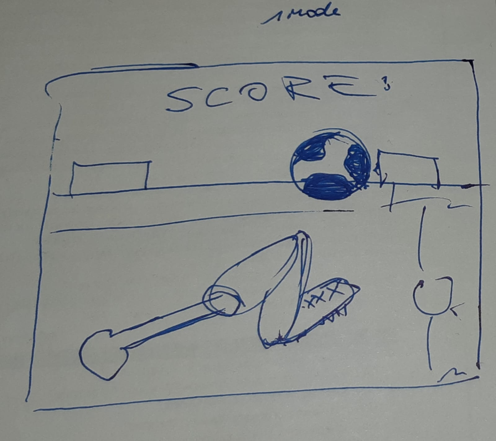
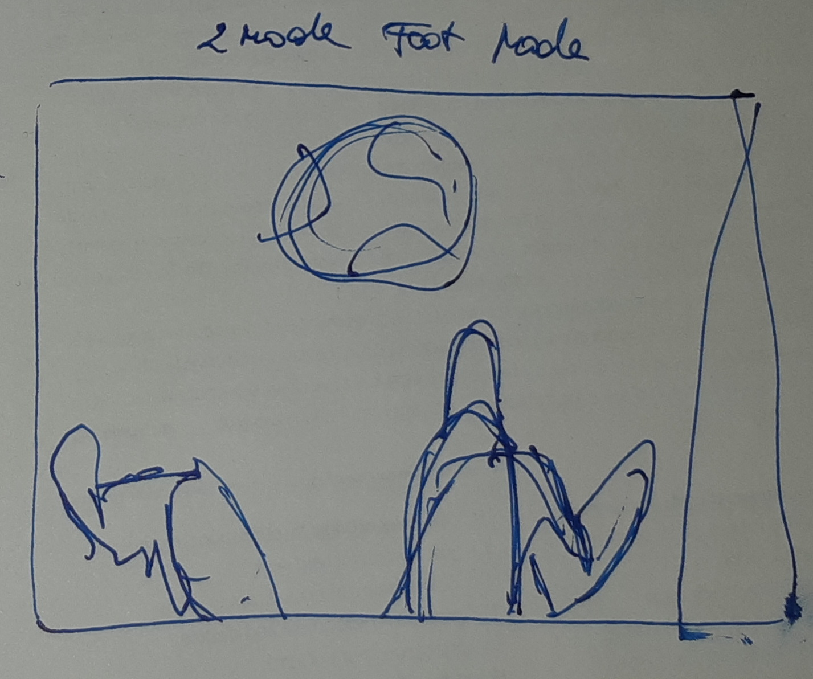
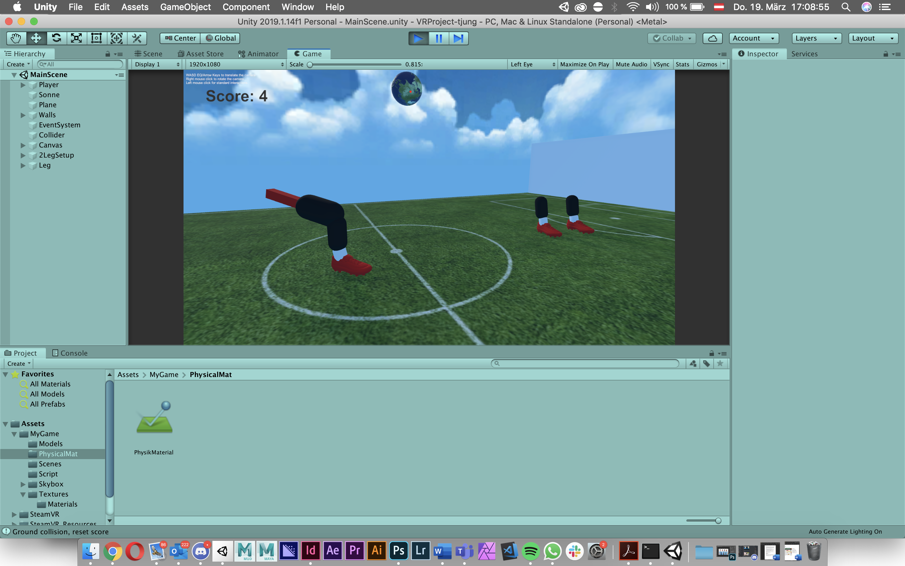
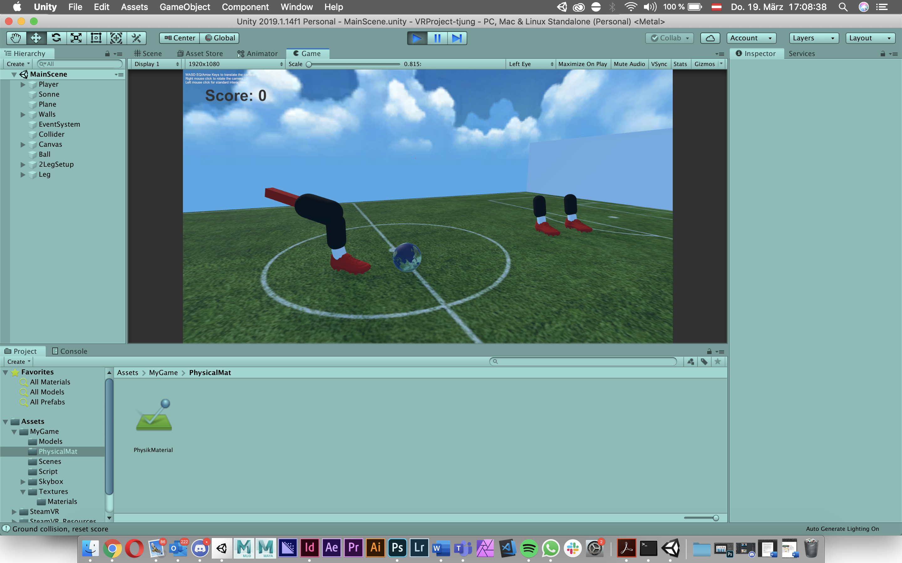

# VRProject-tjung

 
 ### Project description: 
Soccer Juggle Ball Game
Try to juggle the Ball as many times with your foot as you can xD

### Development platform: 
MacOs Mojave, Unity 2019.1.14f, VS Code 1.30.2, Scripting Runtime Version .NET 4.x Equivalent

### Documentation
VR-Fuck Up Projekt

-	Erstellen von Basic Assets (Asset – Internet)
-	Script erstellt um Ball mit Collider kollidieren zu lassen 
-	https://www.youtube.com/watch?v=qD7fDop-Ptw

-	<Tag auf Ball falsch Lösung: Tag auf Collider

-	Added Score Script https://www.youtube.com/watch?v=QbqnDbexrCw

-	Added SteamVR Asset (Throwable, Interactable, Rigidbody)

-	Fehler beim Reseten des Scores, statt collison hatte ich collider
-	Jetzt funktioniert es

-	2D Debug Modus wurde getestet und funktioniert

-	Toor Modelle wurden erstellt und in Szene eingebaut

-	Neue Score Collider wurden für die jeweiligen Toore erstellt

-	Neues Shoot Script für den Ball der ihn mit Force schießen lässt, (bei Mausklick)
### Concept Scribbles https://www.google.com/search?q=apply+force+to+object+unity&rlz=1C5CHFA_enAT815AT816&oq=apply+force+to+obje&aqs=chrome.1.69i57j0l7.7980j1j7&sourceid=chrome&ie=UTF-8#kpvalbx=_p5N7XpLTHobbsAel2Zf4BQ28

   

### Screenshots

 

 

### Target platform: 
VR Oculus Rift / HTC Vive

### Visuals: 
Screenshots (concept and experience), Video

### Necessary setup/execution steps: 
/

### Third party material: 
(if used Fonts, Sounds, Music, Graphics, Materials, Code etc.)

### Project state: 
Starting State 60%

### Limitations: 

No VR headset to try it.

### Lessons Learned: 

How to work use Force and Colliders in scripting

Copyright by Thomas Junger
